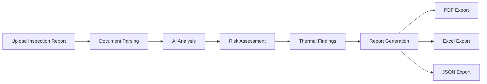

# 🛡️ DDR AI — Intelligent Diagnostic Report Generation

<div align="center">

### 🚀 Live Demo

# 🌐 https://ddr-ai-intelligent-diagnostic-repor.vercel.app

[](https://ddr-ai-intelligent-diagnostic-repor.vercel.app)


### AI-Powered Property Inspection & Diagnostic Report Generation Platform

Transform inspection reports into actionable intelligence using AI-powered document analysis, thermal anomaly detection, risk assessment, and automated report generation.

</div>

---

## ✨ Features

### 📂 Smart Document Processing

* Upload PDF inspection reports
* Multi-column text extraction
* Image extraction support
* Thermal report analysis
* Structured data generation

### 🧠 AI Diagnostic Engine

Powered by OpenAI GPT models.

Automatically extracts:

* Findings
* Observations
* Thermal Anomalies
* Risk Levels
* Root Cause Analysis
* Recommendations

### 🔥 Thermal Intelligence

* Detect abnormal temperature zones
* Extract thermal observations
* Classify severity
* Assign risk scores
* Generate recommendations

### 📊 Executive Dashboard

Real-time analytics:

* Risk Score
* Critical Findings
* Action Priorities
* Observation Count
* Severity Distribution

### 📄 Multi-Format Export

* PDF Reports
* Excel Reports
* JSON Reports

---

## 🏗️ Architecture

```text
                    ┌──────────────────────┐
                    │      Next.js 14      │
                    │      Frontend        │
                    └──────────┬───────────┘
                               │
                               ▼
                    ┌──────────────────────┐
                    │       FastAPI        │
                    │       Backend        │
                    └──────────┬───────────┘
                               │
            ┌──────────────────┼──────────────────┐
            ▼                  ▼                  ▼
      OpenAI GPT-4o      Neon PostgreSQL     File Storage
       AI Analysis          Database           Reports
```

---

## 🛠️ Tech Stack

### Frontend

* Next.js 14
* React 18
* TypeScript
* Tailwind CSS
* Framer Motion
* Lucide React
* React Query
* Axios

### Backend

* FastAPI
* Uvicorn
* SQLAlchemy
* AsyncPG
* PyMuPDF
* PDFPlumber
* Pillow
* OpenAI SDK
* ReportLab
* OpenPyXL

### Database

* Neon PostgreSQL

### Deployment

* Vercel
* Render
* Neon
* OpenAI

---

## 🚀 Core Workflow



---

## 📡 API Endpoints

| Method | Endpoint               | Description             |
| ------ | ---------------------- | ----------------------- |
| GET    | /api/health            | Health Check            |
| POST   | /api/upload            | Upload & Analyze Report |
| GET    | /api/reports           | Fetch Reports           |
| GET    | /api/reports/{id}      | Report Details          |
| GET    | /api/export/pdf/{id}   | Export PDF              |
| GET    | /api/export/excel/{id} | Export Excel            |
| GET    | /api/export/json/{id}  | Export JSON             |

---

## 🌍 Deployment

### Live Application

🌐 https://ddr-ai-intelligent-diagnostic-repor.vercel.app

---

## 🔮 Future Enhancements

* Authentication & Authorization
* OCR for Scanned Reports
* Cloud Storage Integration
* AI Chat with Reports
* Vector Search (RAG)
* Team Collaboration
* Multi-Tenant Workspaces

---

## 🏆 Highlights

✅ Full Stack AI Application

✅ Production Deployment

✅ OpenAI Integration

✅ Neon PostgreSQL

✅ FastAPI Backend

✅ Next.js Frontend

✅ PDF Analysis

✅ Automated Report Generation

✅ Premium SaaS UI/UX

---

## 👨‍💻 Author

### Gurkirat Singh

AI/ML Engineer • Full Stack Developer

GitHub: https://github.com/Gurkirat19

---

<div align="center">

### ⭐ If you like this project, don't forget to star the repository!

Made with ❤️ using Next.js, FastAPI, OpenAI & PostgreSQL

</div>
